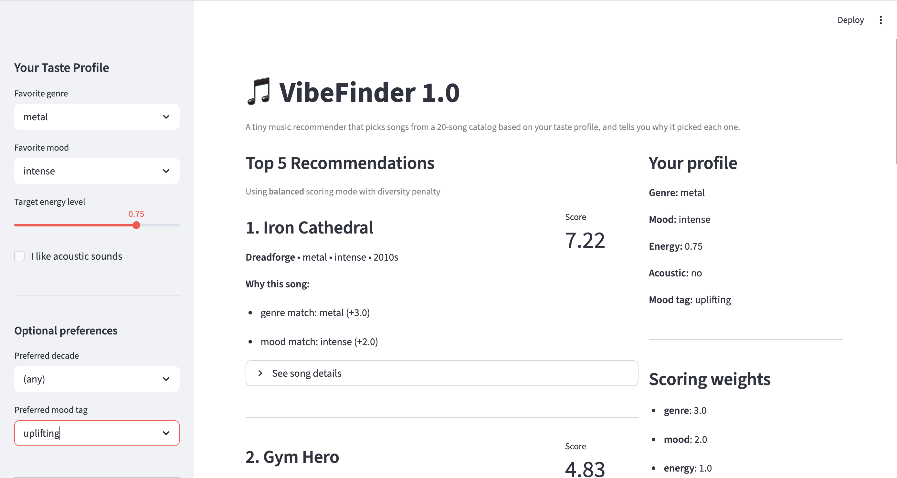
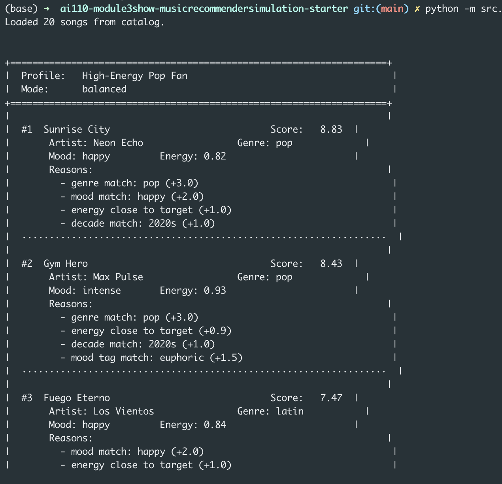

# Music Recommender Simulation

This is a small music recommender I built for class. It takes a made-up user taste profile and picks songs from a tiny catalog of 20 tracks. For every song it picks, it also tells you *why* it picked it, which I think is the more interesting part.

## What's in here

The catalog has 20 songs. I started with the 10 that came in the starter and added 10 more so there'd be a wider mix of genres (hip-hop, R&B, classical, EDM, country, metal, latin, funk, soul, reggae). Each song has the usual stuff like genre, mood, energy, tempo, valence, danceability, and acousticness, plus three extra fields I added: popularity (0 to 100), decade, and a more specific mood tag like "euphoric" or "nostalgic".

A user profile is just a little dictionary with a favorite genre, favorite mood, a target energy level, whether they like acoustic sounds, an optional preferred decade, and an optional mood tag.

## How it picks songs

The idea is simple. For every song in the catalog, I check how well it matches the user profile and hand out points:

- Same genre as the user's favorite: +3.0
- Same mood: +2.0
- Energy close to the target: up to +1.0, depending on how close
- Acoustic preference: up to +1.0 (more points for acoustic tracks if the user likes acoustic, fewer if they don't)
- Valence times 0.5
- Danceability times 0.5
- Popularity bonus worth up to +0.3
- Decade match: +1.0
- Mood tag match: +1.5

Once every song has a score, I sort them from highest to lowest and return the top 5. There's also a diversity penalty so one artist or one genre doesn't completely take over the list. If the same artist shows up twice in the top 5, the second one gets docked 1.5 points. If a genre shows up more than twice, songs in that genre start losing a point too.

I also added four scoring modes that change the weights:

- **Balanced** is the default and spreads weight across everything
- **Genre-First** cranks the genre weight way up to 5.0
- **Mood-First** does the same for mood and also boosts the mood tag
- **Energy-Focused** makes energy similarity the dominant signal

The data flow is basically: take the user profile, score every song, sort them, apply the diversity penalty, return the top K.

## Getting it running

Make a virtual environment if you want one:

```bash
python -m venv .venv
source .venv/bin/activate      # Mac or Linux
.venv\Scripts\activate         # Windows
```

Install the dependencies:

```bash
pip install -r requirements.txt
```

Then run it:

```bash
python -m src.main
```

To run the tests:

```bash
pytest
```

There's also a Streamlit web UI if you want a nicer way to play with it:

```bash
pip install streamlit
streamlit run src/app.py
```

The web UI lets you pick your genre, mood, and energy from the sidebar and see the recommendations update live, with reasons and song details for each pick.



## Terminal output



## Experiments I tried

**Switching scoring modes.** I ran the same "High-Energy Pop Fan" profile through all four modes to see what changed. In balanced mode, Sunrise City and Gym Hero took the top two spots like you'd expect. In genre-first mode, the gap between pop songs and everything else got huge (8.03 vs 3.62 for the next song). In mood-first mode, Fuego Eterno jumped to #1 even though it's latin, not pop, because the mood weight was big enough to outweigh the genre mismatch. Energy-focused mode pulled up a bunch of songs into a tight cluster since lots of tracks have similar energy levels.

**Turning the diversity penalty on and off.** With the chill lofi profile, LoRoom showed up twice in the raw top 5. With the penalty on, the second LoRoom track got pushed down so other artists had room to appear. In this tiny catalog the effect is small but you can see it working.

**A weird edge case.** I made a profile that asks for both high energy (0.95) and a chill mood, which doesn't really make sense together. The system didn't break. It just split the difference and gave a mix of high-energy pop songs and chill tracks, which felt like a reasonable thing to do when the user's preferences contradict themselves.

## Limitations

The catalog is tiny. 20 songs is enough to demo the idea but nothing close to real use. Because the genre match is an exact string comparison, a fan of "indie pop" gets no credit for regular "pop" songs, which feels wrong. The popularity bonus also creates a bit of a feedback loop where already-popular songs get a small boost, which is exactly the kind of thing that makes real recommender systems homogenize over time. The model doesn't understand lyrics or language at all. And my dataset leans pretty heavily toward Western, English-language music from the 2010s and 2020s, so anyone who likes older music or music from other traditions isn't well served.

## Reflection

[Model Card](model_card.md)

The thing that surprised me most was how much the output depends on the weights. I can take the exact same song catalog and the exact same user profile, nudge one number, and get a completely different top 5. That's kind of unsettling when you think about it. The person who picks the weights has a lot of power over what users end up hearing, and there's no objectively correct choice.

It also made me realize how much bias can sneak in through the data itself, before the algorithm even runs. My catalog has three pop songs and only one classical song, so of course pop listeners get better recommendations. Scale that up to a real service and you can see how genres with less data in the system just stay underrepresented forever. The algorithm isn't doing anything "unfair", it's just reflecting what it was given. That feels like a place where a human still has to pay attention, no matter how clever the model gets.
